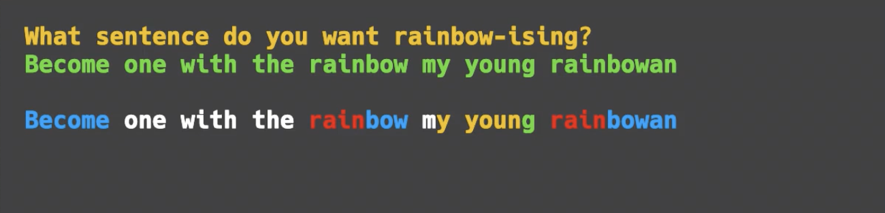

# 👉 Day 38 Challenge

Code the rainbow! 

1. Ask the user to input any sentence (string).
2. Now we'll rainbow-ize (nope, me neither) it.
3. As soon as the string contains an 'r', every letter from that point on should be red.
4. When the computer encounters a 'b', 'g', 'p' or 'y', from there the output should be blue for 'b', green for 'g'...you get the idea.
5. Loop through the string and output it (so the color continues through the loop).
6. The output should change color every time it encounters a new r,g,b,p or y.  

🥳 Extra points for resetting the output color back to default every time there's a space.

Example:

 
 💡 Hints 

  
- You can use a lot of your code from Day 31 to get started.
- Use an `if... elif... else` to check for key letters.
- Use the `print("\033[31m", end="")` to change the font color.
- Try implementing the color change as a subroutine. 

